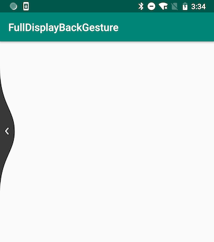

# FullDisplayBackGesture
仿照 MIUI 全面屏后退手势实现了一套，便于移植

## Usage

直接继承自 FullDisplayActivity ( AppCompatActivity ) 即可

也可以直接将 FullDisplayLayout ( FrameLayout ) 作为根 View 使用即可

## TODO

- [ ] listener
- [ ] 纵向跟手